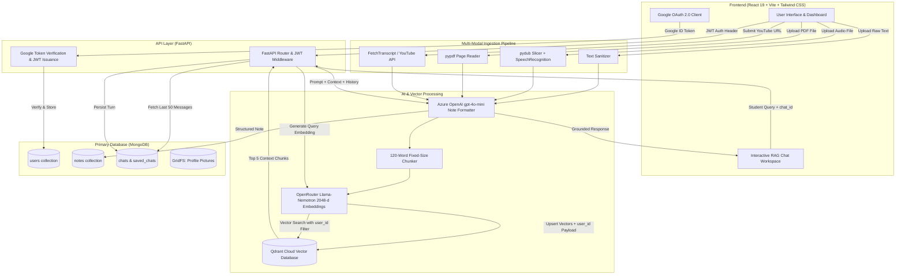

<div align="center">

# 🎓 StudyMinutes

### *Your Intelligent AI-Powered Multi-Modal Study Companion & Knowledge Base*

[](https://studyminutes.tech/)
[](https://fastapi.tiangolo.com/)
[](https://react.dev/)
[](https://vitejs.dev/)
[](https://www.mongodb.com/)
[](https://qdrant.tech/)
[](https://azure.microsoft.com/en-us/products/ai-services/openai-service)
[](https://tailwindcss.com/)

<p align="center">
  <b>Convert messy lecture notes, voice recordings, PDFs, and YouTube videos into structured academic notes, then chat with them using Retrieval-Augmented Generation (RAG).</b>
</p>

</div>

---

## 📑 Table of Contents

- [Overview](#-overview)
- [Key Features](#-key-features)
- [System Architecture](#-system-architecture)
- [RAG Pipeline & Methodology](#-rag-pipeline--methodology)
  - [Chunking Strategy](#1-chunking-strategy)
  - [Vector Embeddings](#2-vector-embeddings)
  - [Vector Search & Multi-Tenant Isolation](#3-vector-search--multi-tenant-isolation)
  - [Grounded Contextual Generation](#4-grounded-contextual-generation)
- [Tech Stack](#-tech-stack)
- [Repository Structure](#-repository-structure)
- [Prerequisites](#-prerequisites)
- [Environment Variables](#-environment-variables)
  - [Backend (.env)](#backend-env)
  - [Frontend (.env)](#frontend-env)
- [Local Installation & Setup](#-local-installation--setup)
  - [1. Clone Repository](#1-clone-repository)
  - [2. Backend Setup](#2-backend-setup)
  - [3. Frontend Setup](#3-frontend-setup)
- [REST API Reference](#-rest-api-reference)
  - [Authentication](#authentication)
  - [Note Ingestion & Management](#note-ingestion--management)
  - [Subject Analytics](#subject-analytics)
  - [Chatbot & Conversation Threads](#chatbot--conversation-threads)
  - [Profile & Account Settings](#profile--account-settings)
- [Database Models & Schemas](#-database-models--schemas)
  - [MongoDB Collections](#mongodb-collections)
  - [Qdrant Vector Payload](#qdrant-vector-payload)
- [Troubleshooting & FAQ](#-troubleshooting--faq)
- [Production Deployment](#-production-deployment)
- [License](#-license)

---

## 🌟 Overview

Students regularly struggle with fragmented, unstructured study materials scattered across hand-written notes, lecture voice memos, lengthy textbook PDFs, and video lectures. 

**StudyMinutes** solves this problem with an end-to-end multi-modal ingestion pipeline and RAG engine:
1. **Multi-Modal Ingestion**: Upload raw text, lecture audio files, academic PDFs, or YouTube links.
2. **AI Structuring**: Uses Azure OpenAI (`gpt-4o-mini`) to normalize chaotic notes into clean academic outlines (Subject, Title, Explanation, and Key Points) while preserving domain-specific terminology and abbreviations.
3. **RAG Semantic Search**: Notes are chunked into 120-word segments and embedded via a 2048-dimensional embedding model into Qdrant Vector DB.
4. **Interactive Chat**: Query your study materials in natural language with strict contextual grounding and conversation history tracking.

---

## 🚀 Key Features

| Feature | Description |
| :--- | :--- |
| 📝 **Text Note Structuring** | Input unorganized scratchpad notes and receive structured notes with standardized subjects and bulleted key takeaways. |
| 🎙️ **Audio-to-Notes Transcription** | Upload lecture voice memos (`.mp3`, `.wav`, `.m4a`). Audio is sliced into 60-second segments, transcribed via SpeechRecognition, and converted into structured notes. |
| 📄 **PDF Extraction** | Upload multi-page textbook chapters and lecture slides. Extracts clean text across up to 50 pages and condenses it into comprehensive study notes. |
| 📺 **YouTube Video Ingestion** | Paste any YouTube video URL. Automatically extracts video transcripts via FetchTranscript API (or `youtube-transcript-api` fallback) and produces instant lecture notes. |
| 🤖 **Grounded RAG Chatbot** | Interactive assistant that retrieves the top 5 most relevant note fragments via Qdrant cosine similarity search and answers student questions accurately. |
| 💬 **Full Conversation Lifecycle** | Chat threads with auto-naming, custom renaming, deleting, and dedicated "Saved Chats" bookmarking. Retains last 50 dialogue turns for rich conversation context. |
| 📊 **Subject Analytics & Filters** | Auto-extracts subject classifications (e.g., Computer Science, Biology, Economics), tracks topic frequency counts, and provides subject-filtered browsing. |
| 💾 **Note Export** | Export the entire library of study notes as a single formatted `.txt` file for offline study or printing. |
| 👤 **Profile & GridFS Media** | Google OAuth authentication, custom user profile pictures stored as binary streams in MongoDB GridFS, and editable display names. |

---

## 🏗️ System Architecture



---

## 🧠 RAG Pipeline & Methodology

Retrieval-Augmented Generation (RAG) ensures that answers provided by the AI assistant are directly sourced from the student's own notes rather than generic LLM hallucinations.

```
+------------------+       +-------------------+       +--------------------+
|  Structured Note | ----> | Fixed 120-Word    | ----> | 2048-dim Vector    |
|  (Output from AI)|       | Non-overlap Chunk |       | (OpenRouter Model) |
+------------------+       +-------------------+       +--------------------+
                                                                  |
                                                                  v
                                                       +--------------------+
                                                       | Qdrant Collection  |
                                                       | payload: user_id   |
                                                       +--------------------+
```

### 1. Chunking Strategy
- **Mechanism**: Fixed-size word-count segmentation implemented in `backend/chatbot.py`.
- **Chunk Size**: Exactly **120 words** per segment (`words[i:i+chunk_size]`).
- **Overlap**: Stride matches chunk size (0-word overlap) to maximize distinct semantic coverage per embedding payload.

### 2. Vector Embeddings
- **Provider**: OpenRouter Embeddings API (`https://openrouter.ai/api/v1/embeddings`)
- **Embedding Model**: `nvidia/llama-nemotron-embed-vl-1b-v2:free`
- **Dimensionality**: **2048 dimensions**
- **Distance Metric**: **Cosine Similarity** (`Distance.COSINE`)

### 3. Vector Search & Multi-Tenant Isolation
When a student asks a question:
1. The question is converted into a 2048-dimensional vector using the same embedding model.
2. Qdrant performs an approximate nearest neighbor (ANN) search over the `user_notes` collection with a strict payload filter:
   ```json
   {
     "must": [
       { "key": "user_id", "match": { "value": "<LOGGED_IN_USER_ID>" } }
     ]
   }
   ```
3. This guarantees complete data isolation: students **never** retrieve another user's notes.
4. The system retrieves the top **5** most relevant note segments (`limit=5`).

### 4. Grounded Contextual Generation
- The top 5 text segments are joined into a system context block.
- The user's last **50 chat turns** are retrieved from MongoDB to maintain conversational memory and topical continuity.
- The compiled prompt is sent to Azure OpenAI (`gpt-4o-mini`), which synthesizes a coherent, strictly grounded response.

---

## 🛠️ Tech Stack

### Frontend
- **Framework**: [React 19](https://react.dev/) + [Vite](https://vitejs.dev/)
- **Styling**: [Tailwind CSS 3](https://tailwindcss.com/)
- **Icons**: [Lucide React](https://lucide.dev/) & [React Icons](https://react-icons.github.io/react-icons/)
- **Routing**: [React Router v7](https://reactrouter.com/)
- **HTTP Client**: [Axios](https://axios-http.com/)
- **Authentication**: [@react-oauth/google](https://www.npmjs.com/package/@react-oauth/google)

### Backend
- **Framework**: [FastAPI](https://fastapi.tiangolo.com/) + [Uvicorn](https://www.uvicorn.org/)
- **Primary Database**: [MongoDB](https://www.mongodb.com/) via [PyMongo](https://pymongo.readthedocs.io/)
- **Binary Storage**: MongoDB GridFS (profile pictures)
- **Vector Database**: [Qdrant Cloud](https://qdrant.tech/) via `qdrant-client`
- **LLM Engine**: [Azure OpenAI Service](https://azure.microsoft.com/en-us/products/ai-services/openai-service) (`gpt-4o-mini`)
- **Embeddings**: [OpenRouter](https://openrouter.ai/) (`nvidia/llama-nemotron-embed-vl-1b-v2:free`)
- **Audio Processing**: [SpeechRecognition](https://pypi.org/project/SpeechRecognition/) + [pydub](https://github.com/jiaaro/pydub) + [FFmpeg](https://ffmpeg.org/)
- **PDF Extraction**: [pypdf](https://pypdf.readthedocs.io/)
- **YouTube Transcripts**: [FetchTranscript API](https://fetchtranscript.com/) & [youtube-transcript-api](https://pypi.org/project/youtube-transcript-api/)
- **Auth & Cryptography**: [python-jose](https://github.com/mpdavis/python-jose), [google-auth](https://github.com/googleapis/google-auth-library-python), [bcrypt](https://pypi.org/project/bcrypt/)

---

## 📁 Repository Structure

```text
study_minutes/
├── backend/
│   ├── app.py                     # Main FastAPI application, routes, and middleware
│   ├── auth.py                    # Google OAuth token verification and JWT handlers
│   ├── chatbot.py                 # RAG logic: chunking, OpenRouter embeddings, Qdrant search, LLM completion
│   ├── ai_formatter.py            # Azure OpenAI note formatting prompt and execution
│   ├── audio_transcriber.py       # Audio splitting into 60s wav files & speech-to-text
│   ├── pdf_processor.py           # Multi-page PDF text extraction via pypdf
│   ├── youtube_processor.py       # YouTube URL parser and transcript fallback scraper
│   ├── db.py                      # MongoDB connection, collections, and GridFS setup
│   ├── models.py                  # Pydantic schemas (GoogleToken, Note)
│   ├── embed_existing_notes.py    # Backfill migration script to re-embed MongoDB notes to Qdrant
│   ├── delete_collection.py       # Utility to reset Qdrant collections
│   ├── test_connection.py         # Connectivity test utility
│   ├── requirements.txt           # Python dependencies
│   └── .env                       # Backend environment variables
│
├── frontend/
│   ├── index.html                 # Main HTML entry point
│   ├── vite.config.js             # Vite build configuration
│   ├── tailwind.config.js         # Tailwind styling configuration
│   ├── package.json               # Node dependencies & npm scripts
│   ├── src/
│   │   ├── main.jsx               # React DOM root mounting
│   │   ├── App.jsx                # Route declarations and Protected/Guest routing guards
│   │   ├── App.css / index.css    # Global stylesheets and Tailwind directives
│   │   ├── pages/
│   │   │   ├── auth.jsx           # Google Login landing page
│   │   │   ├── dashboard.jsx      # Analytics charts, recent activity, upload modals
│   │   │   ├── home.jsx           # Main chat workspace & conversational assistant
│   │   │   ├── notes.jsx          # Grid view of all formatted notes with search & delete
│   │   │   ├── subject.jsx        # Subject-filtered notes explorer
│   │   │   ├── profile.jsx        # User profile, picture upload, display name settings
│   │   │   └── settings.jsx       # Application configuration and user preferences
│   │   └── components/
│   │       ├── Sidebar.jsx        # Navigation panel, chat history list, rename/delete/save
│   │       ├── ChatArea.jsx       # Message thread, query input box, bot thinking animations
│   │       ├── TopNavbar.jsx      # Quick navigation, profile dropdown, theme triggers
│   │       ├── UploadNotes.jsx    # Raw text / notes input modal
│   │       ├── UploadYoutube.jsx  # YouTube URL input modal
│   │       └── SavedChatsModal.jsx# Dedicated modal displaying saved chat sessions
│   └── .env                       # Frontend environment variables
│
├── project_explanation.txt        # Architectural notes and technical deep-dive
└── README.md                      # Project documentation
```

---

## 📋 Prerequisites

Ensure the following runtimes and services are set up before running locally:

1. **Node.js**: v18.0.0 or higher
2. **Python**: v3.10 or higher
3. **FFmpeg**: Required by `pydub` to split and convert audio files into WAV format.
   - **Windows**: `winget install Gyan.FFmpeg` or download from [ffmpeg.org](https://ffmpeg.org/) and add to system `PATH`.
   - **macOS**: `brew install ffmpeg`
   - **Linux (Ubuntu/Debian)**: `sudo apt update && sudo apt install -y ffmpeg`
4. **MongoDB Instance**: Local MongoDB Community server or a free [MongoDB Atlas](https://www.mongodb.com/cloud/atlas) cluster.
5. **Qdrant Vector Database**: Local Docker instance or a free [Qdrant Cloud](https://cloud.qdrant.io/) cluster.
6. **Azure OpenAI Resource**: Deployed `gpt-4o-mini` model instance.
7. **OpenRouter Account**: API key with access to free embedding models.
8. **Google Cloud Console**: OAuth 2.0 Client ID for Web Applications.
9. **FetchTranscript API Key** *(Optional)*: For YouTube video transcript extraction.

---

## 🔐 Environment Variables

### Backend (`backend/.env`)

Create a `.env` file in the `backend/` directory:

```env
# Server & Security
SECRET_KEY=your_random_jwt_secret_key_here
ALGORITHM=HS256
BACKEND_URL=http://127.0.0.1:8000
GOOGLE_CLIENT_ID=your_google_client_id.apps.googleusercontent.com
GOOGLE_CLIENT_SECRET=your_google_client_secret

# MongoDB Connection
MONGO_URI=mongodb+srv://<username>:<password>@<cluster>.mongodb.net/?retryWrites=true&w=majority

# Azure OpenAI (Note Formatting & Chatbot)
OPEN_AI_KEY=your_azure_openai_key
OPEN_AI_ENDPOINT=https://your-resource-name.openai.azure.com/
OPEN_AI_DEPLOYMENT_NAME=gpt-4o-mini

# OpenRouter (Vector Embeddings)
OPENROUTER_API_KEY=sk-or-v1-your-openrouter-api-key

# Qdrant Vector Database
QDRANT_URL=https://your-qdrant-cluster-url.cloud.qdrant.io:6333
QDRANT_API_KEY=your_qdrant_api_key

# YouTube Transcript Provider (Optional)
FETCHTRANSCRIPT_API_KEY=your_fetchtranscript_api_key
```

### Frontend (`frontend/.env`)

Create a `.env` file in the `frontend/` directory:

```env
# Backend API Base URL
VITE_BACKEND_URL=http://localhost:8000

# Google OAuth 2.0 Web Client ID
VITE_GOOGLE_CLIENT_ID=your_google_client_id.apps.googleusercontent.com
```

---

## 💻 Local Installation & Setup

### 1. Clone Repository

```bash
git clone https://github.com/codebyyashvi/study_minutes.git
cd study_minutes
```

### 2. Backend Setup

Open a terminal in the project root:

```bash
cd backend

# Create virtual environment
python -m venv .venv
```

Activate the virtual environment:
- **Windows (PowerShell)**:
  ```powershell
  .\.venv\Scripts\Activate.ps1
  ```
- **Windows (Command Prompt)**:
  ```cmd
  .\.venv\Scripts\activate.bat
  ```
- **macOS / Linux**:
  ```bash
  source .venv/bin/activate
  ```

Install dependencies and run the server:
```bash
pip install -r requirements.txt
uvicorn app:app --reload --host 127.0.0.1 --port 8000
```
The backend will be running at `http://127.0.0.1:8000`. You can inspect interactive Swagger documentation at `http://127.0.0.1:8000/docs`.

### 3. Frontend Setup

Open a second terminal window:

```bash
cd frontend

# Install Node dependencies
npm install

# Start Vite development server
npm run dev
```

The frontend will run at `http://localhost:5173`.

---

## 📡 REST API Reference

All protected routes require an `Authorization: Bearer <JWT_TOKEN>` HTTP header returned by the `/auth/google` route.

### Authentication

#### `POST /auth/google`
Authenticates a user via Google OAuth 2.0 ID Token and returns a 7-day session JWT.
- **Request Body**:
  ```json
  {
    "token": "eyJhbGciOiJSUzI1NiIs..."
  }
  ```
- **Response (200 OK)**:
  ```json
  {
    "token": "eyJhbGciOiJIUzI1NiIsIn...",
    "user": {
      "email": "student@example.com",
      "name": "Jane Doe",
      "picture": "https://lh3.googleusercontent.com/...",
      "created_at": "2026-09-20T14:00:00.000Z",
      "updated_at": null
    }
  }
  ```

---

### Note Ingestion & Management

#### `POST /upload-note`
Receives raw unformatted study text, formats it with Azure OpenAI, saves the structured note to MongoDB, and embeds chunks into Qdrant.
- **Request Body**:
  ```json
  {
    "content": "Today in OS we talked about Semaphores vs Mutex. Mutex is locking mechanism..."
  }
  ```
- **Response (200 OK)**:
  ```json
  {
    "message": "Note saved with AI formatting",
    "note": "Subject: Operating Systems\nTitle: Semaphores and Mutexes\n\nExplanation:\n...\n\nKey Points:\n- ..."
  }
  ```

#### `POST /upload-audio`
Uploads an audio file (`multipart/form-data`). Splits audio into 60s chunks, runs speech recognition, structures the transcript with AI, and stores it in MongoDB and Qdrant.
- **Form Data**: `file` (Binary audio file: `.mp3`, `.wav`, `.m4a`)
- **Response (200 OK)**:
  ```json
  {
    "message": "Audio converted successfully",
    "note": "Subject: ...\nTitle: ...\n..."
  }
  ```

#### `POST /upload-pdf`
Uploads an academic PDF (`multipart/form-data`). Extracts text across up to 50 pages, formats the top 6,000 characters, and creates note + embeddings.
- **Form Data**: `file` (Binary `.pdf` file)
- **Response (200 OK)**:
  ```json
  {
    "message": "PDF processed successfully",
    "note": "Subject: ...\nTitle: ...\n..."
  }
  ```

#### `POST /upload-youtube`
Ingests a YouTube video URL, extracts subtitles/transcripts via FetchTranscript API, formats the text, and indexes embeddings.
- **Request Body**:
  ```json
  {
    "youtube_url": "https://www.youtube.com/watch?v=example123"
  }
  ```
- **Response (200 OK)**:
  ```json
  {
    "message": "YouTube transcript processed successfully",
    "video_title": "Introduction to Algorithms - MIT OpenCourseWare",
    "note": "Subject: Algorithms\nTitle: ...\n..."
  }
  ```

#### `GET /my-notes`
Retrieves all notes created by the authenticated user.
- **Response (200 OK)**:
  ```json
  [
    {
      "_id": "651a2b3c4d5e6f7a8b9c0d1e",
      "user_id": "651a2b001122334455667788",
      "email": "student@example.com",
      "raw_note": "...",
      "structured_note": "Subject: ...",
      "created_at": "2026-09-20T14:10:00+05:30"
    }
  ]
  ```

#### `GET /my-notes/count`
Returns the total count of notes owned by the logged-in student.
- **Response (200 OK)**: `{"total_notes": 12}`

#### `DELETE /notes/{note_id}`
Deletes a specific note from MongoDB and cleans up its vector embeddings in Qdrant.
- **Response (200 OK)**:
  ```json
  {
    "message": "Note deleted successfully",
    "embedding_cleanup": "done"
  }
  ```

---

### Subject Analytics

#### `GET /subject_count`
Parses all structured notes for the `Subject:` header and returns a frequency breakdown.
- **Response (200 OK)**:
  ```json
  {
    "Computer Science": 8,
    "Calculus": 4,
    "Microeconomics": 3
  }
  ```

#### `GET /subject_list`
Returns a deduplicated, sorted list of all academic subjects represented in the student's notes.
- **Response (200 OK)**:
  ```json
  ["Calculus", "Computer Science", "Microeconomics"]
  ```

---

### Chatbot & Conversation Threads

#### `POST /chatbot`
Queries the student's notes using the RAG pipeline.
- **Request Body**:
  ```json
  {
    "question": "What is the difference between Mutex and Semaphore based on my notes?",
    "chat_id": "c1f7a634-789a-4c21-9e12-3456789abcde"
  }
  ```
- **Response (200 OK)**:
  ```json
  {
    "question": "What is the difference between Mutex and Semaphore based on my notes?",
    "answer": "According to your notes on Operating Systems, a Mutex is a locking mechanism intended for single-resource mutual exclusion, whereas a Semaphore..."
  }
  ```

#### `GET /get-chats`
Retrieves a list of all active chat threads for the user, with timestamps and titles.
- **Response (200 OK)**:
  ```json
  [
    {
      "id": "c1f7a634-789a-4c21-9e12-3456789abcde",
      "title": "What is the difference between Mutex...",
      "timestamp": "2026-09-20T14:15:20+05:30"
    }
  ]
  ```

#### `GET /get-chat-history/{chat_id}`
Returns all user questions and bot answers for a specific conversation session.
- **Response (200 OK)**:
  ```json
  [
    { "role": "user", "content": "What is Mutex?" },
    { "role": "bot", "content": "A Mutex is a mutual exclusion lock..." }
  ]
  ```

#### `PUT /rename-chat/{chat_id}`
Renames an existing chat thread.
- **Request Body**: `{"title": "OS Exam Revision"}`
- **Response (200 OK)**:
  ```json
  {
    "message": "Chat renamed successfully",
    "chat_id": "c1f7a634-...",
    "new_title": "OS Exam Revision",
    "modified_count": 4
  }
  ```

#### `DELETE /delete-chat/{chat_id}`
Deletes a chat thread and all associated messages.
- **Response (200 OK)**: `{"message": "Chat deleted successfully", "deleted_count": 8}`

#### `POST /save-chat/{chat_id}` & `DELETE /save-chat/{chat_id}`
Saves a chat thread permanently to bookmarks, or removes it.

#### `GET /get-saved-chats`
Retrieves all bookmarked/saved chat conversations for the current user.

---

### Profile & Account Settings

#### `POST /update-profile-picture`
Uploads a custom profile image (up to 5MB) and stores it in MongoDB GridFS.
- **Form Data**: `file` (Binary image file)
- **Response (200 OK)**:
  ```json
  {
    "message": "Profile picture updated successfully",
    "picture_url": "http://127.0.0.1:8000/profile-picture/651a2..."
  }
  ```

#### `GET /profile-picture/{file_id}`
Streams a stored avatar directly from MongoDB GridFS with appropriate `Content-Type`.

#### `DELETE /delete-profile-picture`
Deletes custom avatar from GridFS and resets the profile avatar.

#### `PUT /update-profile-name`
Updates the user's display name.
- **Request Body**: `{"name": "Jane Developer"}`
- **Response (200 OK)**:
  ```json
  {
    "message": "Profile name updated successfully",
    "name": "Jane Developer"
  }
  ```

#### `GET /export-notes`
Aggregates all notes for the authenticated user and streams them as an inline plain text file attachment (`StudyMinutes_Notes_<timestamp>.txt`).

---

## 🗄️ Database Models & Schemas

### MongoDB Collections

#### 1. `users`
```json
{
  "_id": ObjectId("651a2b001122334455667788"),
  "email": "student@example.com",
  "name": "Jane Doe",
  "picture": "https://lh3.googleusercontent.com/...",
  "profile_picture_id": "651a2bf9876543210fedcba9",
  "created_at": "2026-09-20T12:00:00.000Z",
  "updated_at": "2026-09-20T14:00:00+05:30"
}
```

#### 2. `notes`
```json
{
  "_id": ObjectId("651a2b3c4d5e6f7a8b9c0d1e"),
  "user_id": "651a2b001122334455667788",
  "email": "student@example.com",
  "raw_note": "Raw input string or transcription",
  "structured_note": "Subject: Computer Science\nTitle: ...\n\nExplanation:\n...\n\nKey Points:\n- ...",
  "source": "youtube",
  "youtube_url": "https://youtube.com/watch?v=...",
  "video_title": "Lecture Title",
  "created_at": "2026-09-20T14:10:00+05:30"
}
```

#### 3. `chats`
```json
{
  "_id": ObjectId("..."),
  "user_id": "651a2b001122334455667788",
  "chat_id": "c1f7a634-789a-4c21-9e12-3456789abcde",
  "chat_title": "OS Exam Revision",
  "role": "user",
  "message": "What is the difference between Mutex and Semaphore?",
  "timestamp": "2026-09-20T14:15:20+05:30"
}
```

#### 4. `saved_chats`
```json
{
  "_id": ObjectId("..."),
  "user_id": "651a2b001122334455667788",
  "chat_id": "c1f7a634-789a-4c21-9e12-3456789abcde",
  "saved_at": "2026-09-20T14:30:00+05:30"
}
```

---

### Qdrant Vector Payload

- **Collection**: `user_notes`
- **Vector Configuration**: `size: 2048`, `distance: Distance.COSINE`
- **Indexed Field**: `user_id` (Schema: `keyword`)

```json
{
  "id": "e81d4a89-22a4-44b2-b43d-0d6118d09f78",
  "vector": [0.0142, -0.0521, 0.0891, "...2048 floats..."],
  "payload": {
    "user_id": "651a2b001122334455667788",
    "note_id": "651a2b3c4d5e6f7a8b9c0d1e",
    "text": "Fixed 120-word text fragment from the formatted note content..."
  }
}
```

---

## 🔧 Troubleshooting & FAQ

### 1. `FileNotFoundError` or audio upload errors during `/upload-audio`
- **Cause**: `pydub` requires `ffmpeg` to decode and convert audio files into WAV format.
- **Solution**: Install FFmpeg and ensure the `ffmpeg` executable is present in your system's `PATH`. Run `ffmpeg -version` in your terminal to verify.

### 2. Chatbot returns: `Could not connect to the vector database` (HTTP 503)
- **Cause**: The Qdrant cloud cluster is paused, invalid credentials were provided, or the network is blocked.
- **Solution**: Check `QDRANT_URL` and `QDRANT_API_KEY` in `backend/.env`. If using Qdrant Cloud Free Tier, ensure the cluster has not been auto-suspended.

### 3. Google Login fails with `Invalid Google token` (HTTP 400)
- **Cause**: The `GOOGLE_CLIENT_ID` in `backend/.env` does not match the `VITE_GOOGLE_CLIENT_ID` in `frontend/.env`, or the authorized JavaScript origins in Google Cloud Console do not include `http://localhost:5173`.
- **Solution**: Verify both `.env` files contain the exact same client ID and add your dev and production URLs to Authorized JavaScript Origins in your Google Cloud Console.

### 4. PDF processing returns: `No readable text found in PDF`
- **Cause**: The PDF is a scanned image or contains protected raster graphics rather than selectable text.
- **Solution**: `pypdf` extracts textual streams. OCR for flat, scanned image PDFs is not supported directly without prior optical recognition.

### 5. OpenRouter rate limiting / embedding timeouts
- **Cause**: Using the free-tier embedding model (`nvidia/llama-nemotron-embed-vl-1b-v2:free`) under burst conditions.
- **Solution**: The backend wraps embedding creation in resilient error handling. Re-try after a few moments or configure a dedicated embedding model key in `backend/.env`.

---

## 🌐 Production Deployment

- **Frontend**: Deploy with platforms like [Vercel](https://vercel.com/) or [Netlify](https://www.netlify.com/). Remember to configure `VITE_BACKEND_URL` and `VITE_GOOGLE_CLIENT_ID` in your build environment.
- **Backend**: Deploy on platforms like [Render](https://render.com/), [AWS EC2](https://aws.amazon.com/ec2/), or [DigitalOcean](https://www.digitalocean.com/).
- **CORS**: Ensure your production domain (e.g. `https://studyminutes.tech`) is listed in `backend/app.py` under `CORSMiddleware`.
- **System Dependencies**: Ensure the production container or VM has `ffmpeg` installed.
- **URL Configuration**: Point `BACKEND_URL` in `backend/.env` to your public API domain so GridFS profile picture URLs resolve correctly on the web.

---

## 📄 License

This project is licensed under the [MIT License](LICENSE).
